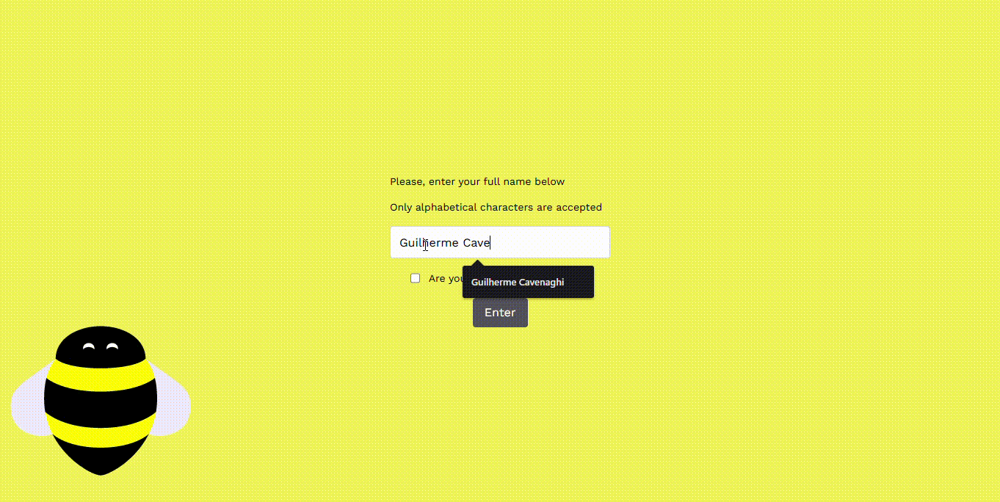

# 🐝 BEES Front-end Challenge

Technical challenge built using **React + TypeScript**, consuming the **Open Brewery DB** API.

---

## 🖼️ Preview

### 🔍 Application Search + Favorites

[](.github/app-preview.gif)

### ⚠️ API Error Handling

[](.github/api-error-preview.gif)

---

## 🎨 Design

The user interface strictly follows [this Figma layout](https://www.figma.com/design/cpXVZeJfxa0DIRMRKwzT1S/BEES-front-end-challenge?node-id=0-1&p=f), respecting spacing, typography, hierarchy, and visual style.

---

## ⚙️ Tech Stack

- [React](https://reactjs.org/) – Front-end library
- [TypeScript](https://www.typescriptlang.org/) – Type safety
- [Styled Components](https://styled-components.com/) – Scoped component styling
- [Axios](https://axios-http.com/) – HTTP client for API calls
- [Zustand](https://github.com/pmndrs/zustand) – Lightweight global state management
- [React Testing Library](https://testing-library.com/) – Component testing
- [Jest](https://jestjs.io/) – Test runner

---

## 🔗 API Used

- [Open Brewery DB](https://www.openbrewerydb.org/documentation)

---

## 📁 Project Structure

```
├── src
│   ├── components         # Reusable UI components
│   │   ├── Company
│   │   ├── Navbar
│   ├── pages              # Page-level views
│   │   ├── Home
│   │   ├── Companies
│   ├── services           # API logic (Axios wrappers)
│   ├── stores             # Global state (Zustand)
│   ├── mocks              # Mock data for tests
│   ├── styles             # Global styles and layout
│   └── utils              # Utility functions/helpers
```

---

## 🧱 Architecture & State Management

- **Zustand** is used for managing global state (`favorites` and `isLoading`) due to its minimal setup, good performance, and ease of use in tests.
- **Axios** is used for HTTP calls and is encapsulated in a `services` layer, allowing mockability and reusability.
- **Styled Components** were used to scope component styles and follow a **design token** approach using `CSS variables` declared in the global style.
- UI feedback components (`<Loader />`, `<Error />`) were abstracted for reuse and centralized feedback UX.

---

## ✅ Features Implemented

- 🔍 Search breweries by name using the Open Brewery DB API
- ➕ Add and remove favorite breweries
- ⌨️ Search triggered via **Enter key** or **Search button**
- 🪝 Global state managed via Zustand
- 🧭 Lazy loading with "Load More" pagination
- 📉 Loading and error feedback using reusable components
- 🔁 Empty state for search and favorites
- 📱 Responsive layout using media queries
- ♿ Semantic HTML and accessibility best practices

---

## 🆕 Additional Features

- Centralized `<Loader />` and `<Error />` with consistent layout
- Smooth keyboard interactions (Enter triggers search input)
- Full use of global theme variables for cleaner code and maintainability

---

## 📌 Potential Improvements

- Add Toast notifications for better user feedback
- Improve test coverage with integration tests
- Add E2E (End-to-End) tests using Cypress or Playwright

---

## 📦 Getting Started

### 📥 Install Dependencies

```bash
npm install
```

### ▶️ Start Development Server

```bash
npm start
```

App will be available at: [http://localhost:3000](http://localhost:3000)

### 🧪 Run Unit Tests

```bash
npm test
```

With code coverage:

```bash
npm test -- --coverage --watchAll=false
```

---

## 👨‍💻 Developed by

**Guilherme Cavenaghi**  
💼 [LinkedIn](https://www.linkedin.com/in/guilherme-cavenaghi/) • 💻 Full-stack Developer
